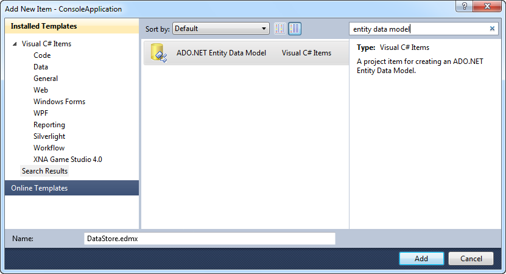
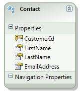
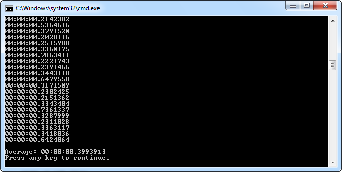
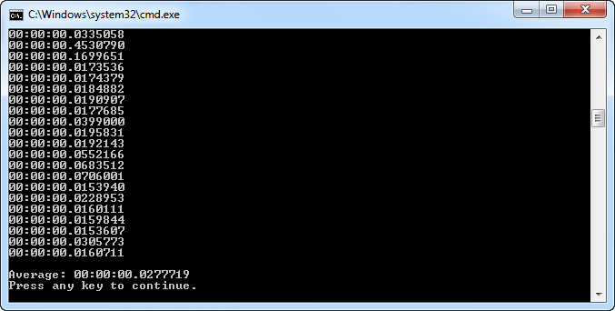

# Entity Framework Bulk Copy

## Introduction

Suppose you wrote an application which uses the Entity Framework and you have to create a new feature which imports a large amount of data. Simple, right? Just iterate through the data you need to import, create the necessary entities, add them to the ObjectContext and call SaveChanges().

This approach might work fine, until you start to import a lot of data. As the amount of data increases, the performance of your application will suffer. If you want to do a bulk insert of data then the Entity Framework (or any other ORM) might not be the way to go.

Sometimes a bit of direct ADO.NET is required. The .NET Framework 2.0 introduced the [SqlBulkCopy class](http://msdn.microsoft.com/en-us/library/system.data.sqlclient.sqlbulkcopy.aspx) which lets you bulk load a SQL Server table with data. Let's see how we can combine the Entity Framework with the SqlBulkCopy class.

## Entity Framework

Let's first demonstrate the performance using the Entity Framework. For this exercise, I created a simple SQL Server 2008 database called MyDataStore. It contains one table named Contact.


Next I created a blank solution ("BulkCopy") in Visual Studio and added a Console Application project to which I added an ADO.NET Entity Data Model called DataStore.



To make things easy I generated the model from the database. After creating the model it contains one simple entity.



I created the following method which inserts a thousand contacts into the Contact table. When it is done it returns the time ([TimeSpan](http://msdn.microsoft.com/en-us/library/system.timespan.aspx)) it took to insert the records.

```csharp
static TimeSpan AddAThousandContacts()
{
    using (var context = new MyDataStoreEntities())
    {
        var stopwatch = new Stopwatch();
        stopwatch.Start();
        for (int i=0; i<1000; i++)
        {
            var entity = new Contact
                                {
                                    CustomerId = Guid.NewGuid(),
                                    FirstName = "Ruben",
                                    LastName = "Geers",
                                    EmailAddress = "geersch@gmail.com"
                                };

            context.Contacts.AddObject(entity);
        }
        context.SaveChanges();
        stopwatch.Stop();
        return stopwatch.Elapsed;
    }
}
```

The Console Application executes this method one hundred times and calculates the average time it takes to insert a thousand contacts.

```csharp
var total = new TimeSpan();
for (int i = 0; i < 100; i++)
{
    var timeTaken = AddAThousandContacts();
    Console.WriteLine(timeTaken);

    total += timeTaken;
}
Console.WriteLine();
var average = new TimeSpan(total.Ticks / 100);
Console.WriteLine(String.Format("Average: {0}", average));
```

When I executed this sample application I got an average time of 0.3993913s. Ok, it didn't take seconds, minutes or hours...but keep in mind this is just a small application which inserts data in a simple table.



When the SaveChanges method is called, the Entity Framework generates and executes commands that perform the insert, update or delete statements. The Entity Framework does not support batch inserts so this will result in degraded performance. If you want to accomplish this kind of bulk insert you need to write some code against the lower layers of ADO.NET directly.

## LINQ Entity Data Reader

Let's improve the performance by using the SqlBulkCopy class. This class contains a method called [WriteToServer(...)](http://msdn.microsoft.com/en-us/library/system.data.sqlclient.sqlbulkcopy.writetoserver.aspx) which has the following overloads:

- [WriteToServer(DataRow())](http://msdn.microsoft.com/en-us/library/ac44f8yy.aspx)
- [WriteToServer(DataTable)](http://msdn.microsoft.com/en-us/library/ex21zs8x.aspx)
- [WriteToServer(IDataReader)](http://msdn.microsoft.com/en-us/library/434atets.aspx)
- [WriteToServer(DataTable, DataRowState)](http://msdn.microsoft.com/en-us/library/09esk03d.aspx)

In order to use the SqlBulkCopy class we need to be able to convert our collection of Contact entities to an array of DataRow instances, a DataTable or an IDataReader.

Luckily, [David Browne](http://archive.msdn.microsoft.com/dbrowne) already created an IDataReader implementation which allows you to read a collection of entities. You can download it here:

[LINQ Entity Data Reader](http://archive.msdn.microsoft.com/LinqEntityDataReader/Release/ProjectReleases.aspx?ReleaseId=389)

Now we can create a new version of the AddAThousandContacts() method using the LINQ Entity Data Reader.

```csharp
static TimeSpan AddAThousandContactsUsingSqlBulkCopy()
{
    var stopwatch = new Stopwatch();
    stopwatch.Start();

    var contacts = new List<Contact>();
    for (int i = 0; i < 1000; i++)
    {
        var entity = new Contact
        {
            CustomerId = Guid.NewGuid(),
            FirstName = "Ruben",
            LastName = "Geers",
            EmailAddress = "geersch@gmail.com"
        };

        contacts.Add(entity);
    }

    var connectionString =
        ConfigurationManager.ConnectionStrings["MyDataStore"].ConnectionString;
    var bulkCopy = new SqlBulkCopy(connectionString);
    bulkCopy.DestinationTableName = "Contact";
    bulkCopy.WriteToServer(contacts.AsDataReader());

    stopwatch.Stop();
    return stopwatch.Elapsed;
}
```

Instead of adding each new Contact entity to the ObjectContext I add them to a generic list. When a thousand contacts have been added the AsDataReader extension method provided by the LINQ Entity Data Reader is used to bulk load the contacts into the database using the SqlBulkCopy class.

If you run this method a hundred times and calculate an average time you should see a drastic improvement.



An average time of 0.0277719s. This is 14.38x faster!

**Remark**: Before you start using this technique be aware that there are a few gotcha's:

- The LINQ Entity Data Reader does not work with POCO's
- You can only add data to one table at a time using the SqlBulkCopy
- The SqlBulkCopy only works with SQL Server
- The order of the scalar properties in your entity should have the same order as the fields in your table definition

There might be other gotcha's, but these are the ones I know off the top of my head.
